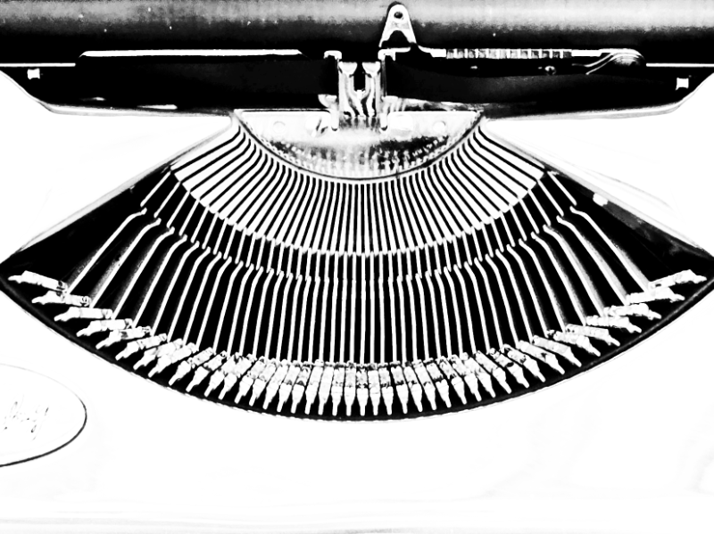

# Ize Compose

Multilingual writing firmware for the [Zerowriter Ink](https://www.zerowriter.org/) (Inkplate 5 V2). Started as a multi-language writing firmware and now supports 92 keyboard layouts across dozens of scripts.

Current release: **v1.4.1**

Code repository: [github.com/ize-studio/ize-compose](https://github.com/ize-studio/ize-compose)



v1.3.0 adds Wi-Fi client document-server mode, splits browser support into SD-loadable files, and preserves the SD settings backup flow.

v1.4.0 adds the top-level `Sync` flow for GitHub private repository sync, then turns the Wi-Fi adapter off after sync. The Bluetooth feature that acted as an external keyboard in v1.3.0 was removed because of battery-use issues. See [RELEASE_1.4.1.md](RELEASE_1.4.1.md) for the current release notes and [RELEASE_1.4.0.md](RELEASE_1.4.0.md) for the original v1.4.0 release.

For browser usage details, see [WEB_INTERFACE.md](WEB_INTERFACE.md).

> **Hardware scope warning**
>
> This repository is currently released for **Zerowriter Ink only**.
> Even if another device has an ESP32 and an e-ink display with matching or similar specifications, this code and firmware should not be treated as a general Inkplate/ESP32 writing firmware yet.
>
> In particular, the keyboard input path is written for the current Zerowriter Ink hardware configuration. If the keyboard, keyboard controller, wiring, or input method changes, the input-handling code must be reviewed and modified before use.

---

## Supported Device

- **Zerowriter Ink** (Inkplate 5 V2)
  - ESP32-based Inkplate 5 V2 e-ink writing device
  - Requires SD card for non-Latin fonts and document storage

---

## Features

**Writing**
- Plain-text editing with cursor navigation
- Multi-language composition engines, including Hangul jamo assembly
- Latin accent cycling, such as cycling the last typed Latin character through diacritic variants
- Right-to-left (RTL) text mode for Arabic-script layouts
- Text search (Ctrl+F)
- Copy / paste (Ctrl+C / Ctrl+V)
- Word and character count (3 display modes)

**Keyboard & Language**
- 92 keyboard layouts selectable from the system menu
- Two independent layout slots: one for English (QWERTY or Dvorak), one for a selected multi-language layout
- 12 script composition engines: Hangul, Arabic, Indic scripts, Thai, Myanmar, Khmer, Lao, Tibetan, Sinhala, Ethiopic, Japanese, Hebrew
- RTL layout support: Arabic, Hebrew, Kurdish (Arabic), Pashto, Persian, Urdu
- The v1.3.0 Bluetooth external-keyboard feature is not included in v1.4.0 because of battery-use issues

**Files**
- Saves and loads `.txt` files on SD card (`/ize_compose/`)
- File browser (up to 256 files)
- Network modes: Sync command plus Network Off, WiFi, and WebServer
- GitHub sync only runs the sync operation and then shuts the Wi-Fi adapter off
- Browser document list shows 12 documents per page with a short preview beside each title
- Documents, settings, firmware/font/image uploads, and GitHub settings are handled from the unified browser page

**Display**
- Partial screen update for fast typing feedback
- Configurable full-refresh threshold
- Boot/sleep image loaded from `/ize_compose/initial.png` on SD card; recommended image size is 1280x720 PNG under 500 KB
- Sleep mode: Ctrl+L or sleep button; wake with wake button

**Settings and updates**
- Device menu keeps Sync at the top and Network near the bottom; the version line is display-only
- The unified browser page Settings & Update tab handles sleep timer, text size, line spacing, character spacing, typing speed, refresh limit, English keyboard, language selection, uploads, online update
- Starting with v1.4.0, the Online Update button can update both firmware and the versioned SD web page from the GitHub Release assets in one flow. v1.4.1 keeps this one-button flow and fixes the follow-up release/update issues found after v1.4.0.
- Settings are saved to device preferences and backed up to `/ize_compose/settings_backup.json`; GitHub token is included so it survives reinstall/reset restore
- Firmware uploads use `izefirmware.bin`
- Font and image uploads are routed by filename

---

## SD Card Required Files

The firmware expects support files on the SD card under `/ize_compose/`.

| SD card path | Required | Purpose |
|---|---:|---|
| `/ize_compose/initial.png` | Recommended | Boot/sleep image |
| `/ize_compose/ize_compose_1-4-1.html` | Required for browser UI | Unified Documents, Settings, Update, and GitHub settings page |
| `/ize_compose/hwalja/hwalja_hangul.bin` | Recommended for multi-language Hangul input | Hangul syllable font |
| `/ize_compose/hwalja/hwalja_jamo.bin` | Recommended for multi-language Hangul input | Hangul jamo/composition font |
| `/ize_compose/hwalja/hwalja_latin.bin` | Recommended | Full Latin and Latin-extended font |
| `/ize_compose/hwalja/hwalja_jp.bin` | Optional | Japanese Hiragana/Katakana |
| `/ize_compose/hwalja/hwalja_greek_cyrillic.bin` | Optional | Greek and Cyrillic |
| `/ize_compose/hwalja/hwalja_arabic.bin` | Optional | Arabic-script layouts |
| `/ize_compose/hwalja/hwalja_indic.bin` | Optional | Indic-script layouts |
| `/ize_compose/hwalja/hwalja_sea.bin` | Optional | Thai, Khmer, Lao, Myanmar, Tibetan |
| `/ize_compose/hwalja/hwalja_misc.bin` | Optional | Ethiopic, Georgian, Armenian, and other scripts |
| `/ize_compose/settings_backup.json` | Generated | Settings backup written by the firmware. Keep it when preserving settings across reset/reinstall. |
| `/ize_compose/upload/izefirmware.bin` | Temporary | Staged firmware file used internally during SD OTA update |

When using files directly from this repository, make sure the final SD card paths match the table above. Font files must end up inside `/ize_compose/hwalja/`.

`initial.png` must be a PNG file, should be prepared at 1280x720, and must stay under 500 KB. The firmware loads it into memory before display; files larger than 500 KB are skipped. The image is centered on the active display canvas and is not automatically scaled down, so oversized images are clipped from the center rather than resized.

The repository `sdcard/ize_compose/` folder contains the unified browser page. Font binaries may be distributed separately or generated from the font tools; the device still expects them at the paths listed above.

---


## Device Menu and Web Pages

The main device menu is intentionally small:

`Sync`, `New`, `Save`, `Count`, `Sleep`, `Network`

Use `Sync` for one-shot GitHub document sync. Use `Network` for `Off`, `WiFi`, or `WebServer`.

- `Off`: turns network services off.
- `WiFi`: scans visible Wi-Fi networks, connects as a client, and serves the unified browser page at the local IP shown on the device.
- `WebServer`: asks for a 10-digit numeric password, starts the fixed `IZEcompose_FileServer` access point, and serves the unified browser page at `http://192.168.4.1/`.

The device screen shows the WebServer password until the browser PIN is accepted. WebServer mode starts its automatic shutdown tracking only after PIN authentication. After that authenticated client session has existed and no clients remain connected for more than 2 seconds, WebServer mode shuts down automatically. Use `Ctrl + Menu` to exit manually.

Detailed browser workflow is documented in [WEB_INTERFACE.md](WEB_INTERFACE.md).

### GitHub Sync Scope

Top-level `Sync` is intended to keep Ize Compose SD-card documents and one private GitHub repository folder aligned.

- `Sync` uses Wi-Fi only for the sync operation. After the sync succeeds or fails, the firmware turns Wi-Fi off and returns to the device menu.
- Because of ESP32 memory load, GitHub sync can run only when the upload plus download count is under 128 files.
- Existing `docNNNN.txt` files can be edited on GitHub; if the GitHub copy is newer, the device downloads it.
- New documents should be created on the device or uploaded through the device Wi-Fi/WebServer unified page as `.txt` files.
- Only files named `doc` plus four digits plus `.txt`, such as `doc0001.txt`, are GitHub sync documents.
- `docNNNN.txt` files created only on GitHub are removed on the next sync, because the device assigns document numbers and owns document creation.
- Files that do not match `docNNNN.txt` are ignored by device sync and remain only on GitHub. To keep a GitHub copy while removing it from the device, rename it on GitHub first, for example by removing the first `0` from `doc0001.txt`, then delete the device copy.
- Files deleted only on GitHub are uploaded back on the next sync if the SD card still has them.
- Device-side deletion is kept and still requires the device confirmation flow; use that path when a document should be removed from both sides.

Do not put a repository-side `index.html` document manager in the private writing repository. Private GitHub HTML files cannot be opened as a live web page without downloading them first, so online file management is not part of this release.

---

## Keyboard Layouts (92)

The firmware includes 92 keyboard layouts. The authoritative layout names and keymaps are defined in `src/jado.h`; this README keeps the count and points to the source instead of duplicating a long multilingual list.

---

## Font Files

The firmware has a built-in Latin fallback font. The full Latin font and all non-Latin script fonts are loaded from SD card at boot when the font files are present.

In a release install package, these files should be arranged under:

`Ize-compose/sdcard/ize_compose/hwalja/`

Copy the contents of `Ize-compose/sdcard/` to the root of the SD card. The device expects the font files in `/ize_compose/hwalja/`.

| File | Scripts covered |
|---|---|
| `hwalja_hangul.bin` | Multi-language Hangul syllables |
| `hwalja_jamo.bin` | Multi-language Hangul jamo/composition glyphs |
| `hwalja_latin.bin` | Latin and Latin extended |
| `hwalja_jp.bin` | Japanese (Hiragana, Katakana) |
| `hwalja_greek_cyrillic.bin` | Greek, Cyrillic |
| `hwalja_arabic.bin` | Arabic, Persian, Urdu, Pashto, Kurdish Arabic |
| `hwalja_indic.bin` | Devanagari, Bengali, Gujarati, Kannada, Malayalam, Punjabi, Tamil, Telugu, Sinhala |
| `hwalja_sea.bin` | Thai, Khmer, Lao, Myanmar, Tibetan |
| `hwalja_misc.bin` | Ethiopic, Georgian, Armenian, and others |

Without these files the device still works, but only the built-in Latin fallback font is available.

### v1.1.1 Arabic font update

`hwalja_arabic.bin` was regenerated in v1.1.1 so Arabic presentation forms use the full 8-pixel cell width. This reduces unwanted left/right blank space and improves visual connection between glyphs that should join.

---

## Build Environment

### Platform / Board / Framework

| Item | Value |
|---|---|
| Platform | `espressif32` |
| Board | `esp32dev` + Inkplate 5 V2 build flags |
| Framework | Arduino |
| CPU clock | 240 MHz |
| Upload / monitor speed | 921600 baud |

> `board = esp32dev` is used with manual build flags rather than a dedicated Inkplate board definition. This firmware will not work on a generic ESP32 dev board. The flags, PSRAM assumptions, display path, and keyboard input code are specific to the Zerowriter Ink / Inkplate 5 V2 hardware.

### Libraries

| Library | Version | Source |
|---|---|---|
| InkplateLibrary | 11.0.0 | `lib/` (local, no separate install needed) |
| SdFat | 2.3.1 | PlatformIO registry |
| U8g2_for_Adafruit_GFX | 1.8.0 | PlatformIO registry |
| Adafruit GFX Library | 1.12.6 | PlatformIO registry |
| Adafruit BusIO | 1.17.4 | PlatformIO registry |

### Build flags

| Flag | Purpose |
|---|---|
| `-DARDUINO_INKPLATE5V2` | Board identification |
| `-DINKPLATE_5V2` | Enables correct code path inside InkplateLibrary |
| `-DBOARD_HAS_PSRAM` | Declares PSRAM presence to ESP-IDF |
| `-mfix-esp32-psram-cache-issue` | Workaround for ESP32 PSRAM cache bug (older silicon) |
| `-DSCREEN_WIDTH=800` / `-DSCREEN_HEIGHT=600` | Display resolution constants |
| `-Os` | Size optimization for OTA-safe firmware size |
| `-DIZE_INKPLATE_MINIMAL_IMAGE=1` | Keeps only the image loading path this firmware uses |
| `-DIZE_ENABLE_DIRECT_GITHUB_SYNC=1` | Builds the direct GitHub sync path |
| `-DIZE_ENABLE_BLE_KEYBOARD=0` | Keeps removed Bluetooth keyboard code out of the build |
| `-D CORE_DEBUG_LEVEL=0` | Suppresses all serial debug output |

### Flash / partition settings

| Item | Value |
|---|---|
| Partition table | `min_spiffs.csv` |
| Flash speed | 80 MHz |
| Flash mode | QIO (quad I/O) |

> The clean v1.1.1 package includes `min_spiffs.csv` at the project root so the build does not depend on a hidden PlatformIO package path.

---

## Installation

### Requirements
- [PlatformIO](https://platformio.org/) (VS Code extension or CLI)
- Zerowriter Ink (Inkplate 5 V2) with SD card

### Recommended release install

Download or open the `Ize-compose/` package.

1. Upload `Ize-compose/firmware/izefirmware.bin` as the firmware image.
2. Copy the contents of `Ize-compose/sdcard/` to the SD card root.
3. Confirm that the SD card contains `/ize_compose/initial.png`, `/ize_compose/ize_compose_1-4-1.html`, and `/ize_compose/hwalja/*.bin`.

### Build and flash from source
```bash
git clone <this repo>
cd <repo>
pio run --target upload
```

### SD card setup
1. Format SD card as FAT32.
2. Create `/ize_compose/` and `/ize_compose/hwalja/` on the SD card if they are not already present.
3. Copy `initial.png` to `/ize_compose/`. Use a 1280x720 PNG under 500 KB.
4. Copy `ize_compose_1-4-1.html` to `/ize_compose/`.
5. Copy `hwalja_*.bin` font files into `/ize_compose/hwalja/`.
6. Keep `settings_backup.json` if it exists and you want to preserve settings across reset/reinstall.

### Firmware OTA update (WiFi)
If the device is already running v1.3.x, update from the WebServer or WiFi browser page. If the installed firmware does not provide that browser update page, disconnect the keyboard cable and connect the device by USB for a wired firmware upload.

1. Open `Menu -> Network -> WebServer` or `Menu -> Network -> WiFi`.
2. Enter the 4-digit PIN on the device.
3. Connect to the device access point from a PC or phone.
4. Open `http://192.168.4.1/` in a browser.
5. Select the firmware file. The upload page sends it as `izefirmware.bin`.
6. Wait for the device update/reboot flow to finish.

For document transfer, settings recovery, and update usage, see [WEB_INTERFACE.md](WEB_INTERFACE.md).

---

## Keyboard Shortcuts

| Shortcut | Action |
|---|---|
| Ctrl+Space | Toggle selected language / English mode |
| Ctrl+L | Sleep (shows boot image) |
| Ctrl+F | Text search |
| Ctrl+C | Copy all text to clipboard |
| Ctrl+V | Paste clipboard |
| Space (accent cycling) | Cycle diacritic variants for last character |

---

## Repository Structure

```
Ize-compose/
  firmware/
    izefirmware.bin       - release firmware image
  sdcard/
    ize_compose/
      initial.png         - boot/sleep image
      ize_compose_1-4-1.html - unified browser page
      hwalja/
        hwalja_*.bin      - font files to copy to SD card
      settings_backup.json - generated settings backup, if present
  src/                    - clean PlatformIO firmware source
  lib/InkplateLibrary/    - local Inkplate driver required for build
  others/                 - font sources and helper tools, not compiled
  WEB_INTERFACE.md        - browser page usage guide
  INSTALL.md              - install/build notes
  RELEASE_1.4.1.md   - v1.4.1 release notes
  RELEASE_1.4.0.md   - v1.4.0 release notes
  RELEASE_1.1.2.md        - v1.1.2 release notes
  RELEASE_1.1.1.md        - v1.1.1 release notes

src/
  IZEcompose.ino        - main firmware
  jado.h                - keyboard layout definitions and keymaps (92 layouts)
  jeong_eum.h           - multi-language composition engine and script engine types
  insoe.h               - text rendering, font selection
  PsramAssets.h         - PSRAM asset loading helpers

lib/
  InkplateLibrary/      - Inkplate driver (local copy)

tools/
  make_fonts.py         - script used to build hwalja_*.bin from font sources
  u8g2/bdfconv.exe      - BDF font converter (used by make_fonts.py)

build/
  fontbuild*/           - intermediate font build artifacts
  noto_fonts/           - source Noto font TTFs used for font building

others/
  *.ttf                 - original/reference font files
  reference-headers/    - unused generated/reference headers, not compiled

platformio.ini          - PlatformIO build config
```

---

## Current Limitations

- Supports only Zerowriter Ink / Inkplate 5 V2. Other Inkplate boards are outside this release scope.
- Mid-syllable cursor movement during Hangul composition is not supported.
- Only `.txt` files; no formatting.
- Single document open at a time.
- Bluetooth keyboard mode was removed in v1.4.0 because the v1.3.0 external-keyboard feature caused battery-use issues.

---

## Credits

- [Inkplate Arduino Library](https://github.com/SolderedElectronics/Inkplate-Arduino-library) - Soldered Electronics
- [U8g2_for_Adafruit_GFX](https://github.com/olikraus/U8g2_for_Adafruit_GFX) - Oliver Kraus
- [SdFat](https://github.com/greiman/SdFat) - Bill Greiman
- [Noto Fonts](https://fonts.google.com/noto) - Google, used for font building under the SIL OFL 1.1 license
- [Zerowriter Ink](https://www.zerowriter.org/) - original hardware

<div class="site-support" aria-label="Support">
        
        <p>I build strange little writing tools.<br>If you enjoyed this project, coffee support is welcome.</p>
        <p>Ko-fi: <a href="https://ko-fi.com/dievesa">https://ko-fi.com/dievesa</a></p>
      </div>

### v1.4.1 unified browser note

`/ize_compose/ize_compose_1-4-1.html` replaces the previous separate `property_update.html` and `document_server.html` pages. WiFi mode and WebServer mode serve the same page with Documents and Settings & Update tabs.

WebServer mode uses the fixed SSID `IZEcompose_FileServer`, but the device now asks for a 10-digit numeric Wi-Fi password before starting the access point. The password is shown on the device until the browser PIN is accepted. Automatic shutdown starts only after PIN authentication; after an authenticated client session has existed, WebServer mode shuts down if no clients remain connected for more than 2 seconds.

Online firmware update is connected to firmware endpoints. Local SD upload remains the supported path for fonts and `initial.png`.
### v1.4.1 online update assets

Online update checks the GitHub release firmware asset and the SD web-page asset. If the release includes a newer `ize_compose_<version>.html`, the device downloads that SD web page before starting firmware OTA. OTA begins only after every required download has completed.

The web page filename includes the firmware/web-page version, for example `ize_compose_1-4-1.html`, so the currently served page is not overwritten while the browser is open.

Source and releases: [github.com/ize-studio/ize-compose](https://github.com/ize-studio/ize-compose)

.jpg)
