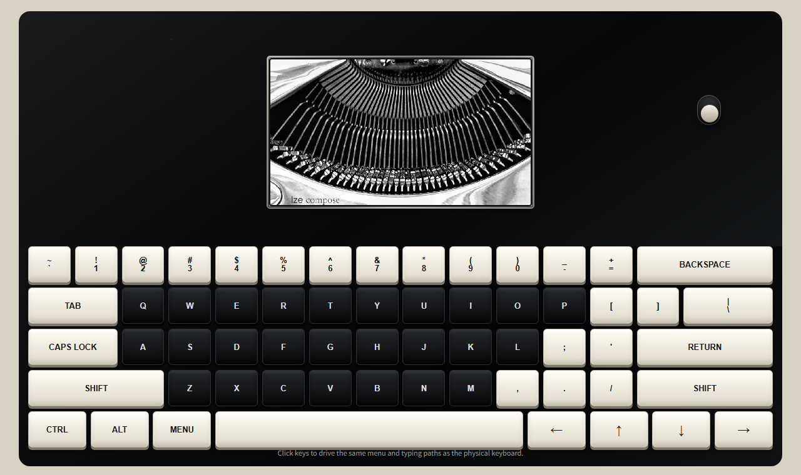

# Ize Compose Emulator

Ize Compose Emulator is a browser-based HTML emulator for the Ize Compose / Zerowriter device experience. It reproduces the visible device layout, e-ink screen behavior, keyboard input flow, document list, simulated network menu, web management screen, and GitHub document sync workflow.

This emulator is not a replacement for the firmware. It is a simulation for checking and testing the main user experience in a browser.

Firmware reference: `1.4.1`.

## Repository Layout

```text
codes/
  index.html              # Main emulator HTML file
  key-engine.js           # Character composition and key processing helper
  keyboard-layouts.js     # Keyboard layout data
others/
  initial.png             # Initial / sleep screen image
  emulator-render.png     # Rendered emulator preview image
ize-compose-emulator.md   # This document
```

The emulator is launched from `codes/index.html`.

`codes/index.html`, `codes/key-engine.js`, `codes/keyboard-layouts.js`, and `others/initial.png` are connected by relative paths. Keep the downloaded folder structure intact. Do not move individual files into separate folders.

## Rendered Preview



The preview image is a browser-rendered capture of `codes/index.html` and is stored at `others/emulator-render.png`.

## How To Download And Run

Do not open each file in GitHub preview and save it one by one. Download the repository as a ZIP file, unzip it, and keep all files together in the extracted folder.

Repository code page: [ize-studio/ize-compose emulator branch](https://github.com/ize-studio/ize-compose/tree/emulator)

Download steps:

1. Open the GitHub repository page.
2. Click the `Code` button.
3. Choose `Download ZIP`.
4. Choose a local folder where the ZIP file will be saved.
5. Save the ZIP file there.
6. Extract the ZIP file.
7. Confirm that the extracted folder contains `codes/`, `others/`, and `ize-compose-emulator.md` at the same level.
8. Open `codes/index.html` in a browser.

Recommended first run:

1. Open `codes/index.html`.
2. Turn on the emulator with the power switch.
3. The browser may ask for local storage folder permission after the file is opened and the emulator is powered on for the first time.
4. If you want documents to be stored in an actual local folder, click `Select Folder` and allow folder access.
5. If you only want browser-local storage, close or skip the folder prompt.
6. Click the e-ink screen area to focus the emulator.
7. Type with the physical keyboard or click the on-screen keyboard.

Browser security rules can block some local file features until the first user action. Keyboard sound and power switch sound are generated with Web Audio and do not use external audio files.

## Main Screen

The emulator has three main visible areas:

| Area | Description |
| --- | --- |
| E-ink screen | Shows the writing area, status bar, menu, network status, sleep screen, and document list. |
| Physical-style keyboard | Clickable keyboard matching the device layout. Physical keyboard events and mouse/touch key clicks use the same input path. |
| Hidden browser controls | Internal browser controls are mostly hidden because the emulator is meant to behave like the device. |

When a key signal is active, white keys flash yellow and black keys flash purple. The key highlight stays active while the key signal is held.

## Writing Screen

Click the e-ink screen or use the physical keyboard to type into the current document.

Text is not drawn instantly at the exact keydown moment. The emulator uses a delayed input display to better match the device typing feel. Current default typing delay is managed in `codes/index.html`.

Writing shortcuts:

| Input | Action |
| --- | --- |
| Normal character | Insert character at the cursor |
| `Enter` | Insert line break |
| `Backspace` | Delete character before cursor |
| `Tab` | Insert four spaces |
| `CapsLock` | Toggle uppercase input state |
| Arrow keys | Move cursor |
| `Home` / `End` | Move to start / end of document |
| `Ctrl + Backspace` | Delete word before cursor |
| `Ctrl + Left` / `Ctrl + Right` | Move cursor by word |
| `Ctrl + Up` / `Ctrl + Down` | Move to start / end of document |
| `Ctrl + S` | Save current document |
| `Ctrl + N` | Create a new document |
| `Ctrl + F` | Search |
| `Ctrl + L` | Sleep |
| `Ctrl + Space` | Toggle English / Korean input |
| `Esc` or `Menu` | Open menu |

Because this is a browser-based emulator, some physical keyboard shortcuts that use `Alt` or `Ctrl` may be intercepted by the browser or operating system before they reach the emulator. The exact behavior depends on the browser, OS, and active browser focus. If a shortcut is taken by the browser, use the on-screen emulator key or the emulator menu instead.

The status bar shows writing-related state such as input language, character count, word count, current file name, save status, and a simulated battery indicator.

## Text Settings

The web settings screen exposes text-related controls:

| Setting | Purpose |
| --- | --- |
| Text Size | Controls rendered text size. The user-facing default starts at `2.0`, mapped to the emulator's current internal baseline. |
| Line Space | Controls line spacing. |
| Character Space | Controls character spacing. Default is `0`. |
| English Keyboard | Selects QWERTY or Dvorak. |
| Language | Selects input language. |

The device menu language display is intentionally not described here because that area is scheduled for update.

## Menu

Open the menu with `Esc`, the `Menu` key, or the hidden side panel menu button if it is exposed during development.

The menu contains a left command list and a right document list.

Menu items:

| Item | Action |
| --- | --- |
| `Sync` | Open the GitHub / network sync status screen |
| `New` | Create a new `docNNNN.txt` document |
| `Save` | Save the current document |
| `Count` | Change counter display mode |
| `Sleep` | Enter sleep mode |
| `Network` | Open network mode |

Menu controls:

| Input | Action |
| --- | --- |
| `Up` / `Down` | Move within the focused list |
| `Left` / `Right` | Move focus between menu commands and document list |
| `Enter` | Run selected command or open selected document |
| `Tab` / `Esc` | Close menu or cancel the current prompt |
| `Backspace` / `Delete` | Start document deletion when the document list is focused |

### Document Deletion From Menu

Document deletion is not immediate.

1. Focus a document in the document list.
2. Press `Backspace` or `Delete`.
3. The screen shows a delete prompt.
4. Press `Enter` to request a six-digit delete code.
5. Type the same six-digit code.
6. Press `Enter` to delete.
7. Press `Tab`, `Esc`, `Menu`, or `Backspace` again to cancel.

If the last document is deleted, the emulator creates a blank document automatically.

## Search

Open search with `Ctrl + F` or the hidden side panel search button if exposed during development.

Search controls:

| Input | Action |
| --- | --- |
| Normal character | Type search query |
| `Backspace` | Delete query character |
| `Enter` | Find next match |
| `Esc` | Exit search |

When a match is found, the cursor moves to the match and the screen highlights the result.

## Sleep And Power

Sleep mode can be triggered by:

| Input | Action |
| --- | --- |
| `Ctrl + L` | Enter sleep |
| Menu `Sleep` | Enter sleep |
| Power switch | Toggle power / sleep state |

Sleep entry and wake behavior include a simulated e-ink clear sequence:

```text
1.5 second delay
0.2 second full black screen
0.2 second full white screen
sleep image or writing screen
```

The power switch and keyboard input use simulated Web Audio sounds.

## Web Interface

The web interface is a simulated version of the device management screen. It appears as an in-browser modal or page, not as a real device-hosted web server.

When the web interface opens, it asks for a four-digit PIN. The required PIN is the same four-digit `state.webPin` value displayed on the device screen. Other values do not unlock the web interface.

Web tabs:

| Tab | Purpose |
| --- | --- |
| `Documents` | Upload, read, download, and delete text documents |
| `Settings & Update` | Change settings, enter GitHub sync details, and show simulated update controls |

### Documents Tab

| Action | Description |
| --- | --- |
| Upload Text | Saves pasted text as the next `docNNNN.txt` document |
| Read | Opens the document in a read-only web view |
| Back | Returns from the read view to the document list |
| Download | Downloads the document as a `.txt` file |
| Delete | Deletes a document after six-digit confirmation |

The `Read` action opens a read-only view inside the web interface. `Back` returns to the document list. It should not close the whole web interface.

Web document deletion also requires a six-digit confirmation code.

### Settings And Update Tab

The settings tab includes text settings, English keyboard layout selection, language selection, GitHub Sync, and simulated firmware/resource update cards.

Current emulator behavior:

| Area | Behavior |
| --- | --- |
| Text Size | Connected to the emulator text renderer |
| Line Space | Connected to the emulator text renderer |
| Character Space | Connected to the emulator text renderer |
| English Keyboard | Changes English keyboard layout |
| Language | Changes input language |
| Sleep Timer | Visible, but not fully wired to firmware-equivalent behavior |
| Speed | Visible, but typing queue delay is currently code-managed |
| Refresh | Visible, but not fully wired to firmware-equivalent behavior |
| Firmware Update | Simulated UI only |
| Font / Image Upload | Simulated UI only |
| Online Firmware Update | Simulated UI only |

## GitHub Sync Setup

GitHub Sync lets the emulator sync local `.txt` documents with a GitHub repository folder. It uses the GitHub REST API from the browser.

You need:

| Item | Description |
| --- | --- |
| GitHub account | Personal or organization account |
| Private repository | Recommended for personal documents |
| `documents/` folder | Folder used for synced text files |
| Personal access token | Token with repository contents read/write permission |
| Browser network access | Required for GitHub API calls |

Official GitHub references:

- [Creating a new repository](https://docs.github.com/en/repositories/creating-and-managing-repositories/creating-a-new-repository)
- [Managing your personal access tokens](https://docs.github.com/en/authentication/keeping-your-account-and-data-secure/managing-your-personal-access-tokens)

GitHub UI labels can change over time. This guide describes the general GitHub web flow as of June 2026.

### Full GitHub Sync Overview

1. Create a private GitHub repository.
2. Create a `documents/` folder in that repository.
3. Create a personal access token.
4. Copy the token immediately after it is generated.
5. Open the emulator web interface and enter the four-digit PIN shown on the device screen.
6. Paste Owner, Repository, Branch, and Token into GitHub Sync settings.
7. Click `Save GitHub Settings`.
8. Click `Sync Now`.

### 1. Create A Private Repository

1. Open `https://github.com` and sign in.
2. Click the `+` button in the upper-right area.
3. Choose `New repository`.
4. Select the account or organization under `Owner`.
5. Enter a repository name.
   - Example: `ize-compose-documents`
6. Under visibility, choose `Private`.
7. You may enable `Add a README file`, but it is not required.
8. `.gitignore` and license are not required for a document storage repository.
9. Click `Create repository`.

Values used by the emulator:

| GitHub page value | Emulator field |
| --- | --- |
| Repository owner name | `Owner` |
| Repository name | `Repository` |
| Branch name | `Branch` |

Example:

```text
Repository URL: https://github.com/ize-studio/ize-compose-documents

Owner: ize-studio
Repository: ize-compose-documents
Branch: main
```

### 2. Create The `documents/` Folder

The emulator uses `documents/` as the GitHub document folder.

Git does not store empty folders, so create a file inside the folder.

Option A: create `.gitkeep`.

1. Open the new repository page.
2. Click `Add file`.
3. Choose `Create new file`.
4. In the file name field, type `documents/.gitkeep`.
5. Leave the content empty or add a short note.
6. Click `Commit changes`.

Option B: create the first document manually.

1. Click `Add file`.
2. Choose `Create new file`.
3. In the file name field, type `documents/doc0001.txt`.
4. Add a short text body.
5. Click `Commit changes`.

The emulator sync target is `.txt` documents. `.gitkeep` is only used to make the folder exist.

### 3. Create A Fine-Grained Personal Access Token

Fine-grained personal access tokens are recommended because they can be limited to one repository.

1. In GitHub, click your profile photo in the upper-right corner.
2. Click `Settings`.
3. In the left menu, click `Developer settings`.
4. Open `Personal access tokens`.
5. Choose `Fine-grained tokens`.
6. Click `Generate new token`.
7. Enter a token name.
   - Example: `Ize Compose Emulator Sync`
8. Choose an expiration.
9. Under `Resource owner`, select the account or organization that owns the repository.
10. Under `Repository access`, choose `Only select repositories`.
11. Select the private repository you created.
12. Under `Repository permissions`, find `Contents`.
13. Set `Contents` to `Read and write`.
14. `Metadata` is usually added automatically as read-only.
15. Other permissions are not required for document sync.
16. Click `Generate token`.
17. When GitHub shows the token, copy it immediately.

The repository access step is important. If the token is not allowed to access the selected private repository, the emulator cannot read, upload, update, or delete files.

Organization repositories may require organization approval before the token works. Follow GitHub's approval flow if GitHub shows an organization approval message.

GitHub shows the full token only once. If you leave the page without copying it, create a new token.

### 4. Copy The Token

After token generation:

1. Click the copy button next to the token, or select the token text manually.
2. Press `Ctrl + C` if selecting manually.
3. Do not paste the token into public notes, chats, documentation, or repository files.
4. Treat the token like a password.

To confirm that copying worked, paste it only into the emulator Token field. The token may be hidden by the browser input field.

### 5. Paste GitHub Details Into The Emulator

1. Open `codes/index.html` in a browser.
2. Press the emulator `Web` control or open the web interface through the device menu flow.
3. Check the four-digit PIN shown on the device screen.
4. Enter that same four-digit PIN in the web PIN field.
5. Click `Open`.
6. Open the `Settings & Update` tab.
7. Find the `GitHub Sync` card.
8. Enter the repository owner in `Owner`.
9. Enter the repository name in `Repository`.
10. Enter the branch name in `Branch`.
    - Usually `main`.
11. Click the `Token` field.
12. Press `Ctrl + V` to paste the copied token.
13. If this is a private computer and you want the browser to keep the token, enable `Save token on this computer only`.
14. On a shared computer, leave that checkbox off.
15. Click `Save GitHub Settings`.
16. Confirm that the status message changes.
17. Click `Sync Now`.

`Save GitHub Settings` only saves the settings. It does not run document sync. `Sync Now` starts the sync.

### GitHub Sync Fields

| Field | Meaning |
| --- | --- |
| `Owner` | GitHub username or organization name |
| `Repository` | Repository name |
| `Branch` | Branch to sync with, usually `main` |
| `Document path` | Currently fixed to `documents` |
| `Token` | GitHub token with contents read/write permission |
| `Save token on this computer only` | Stores the token in this browser only |
| `Delete token` | Removes saved and session tokens |

If the token field is left blank while saving, the emulator tries to keep the existing saved token. Token replacement and deletion depend on the save-token checkbox and the `Delete token` button.

### Sync Behavior

The emulator compares local documents with remote GitHub documents and creates a sync plan.

| Situation | Result |
| --- | --- |
| Local `.txt` document exists only locally | Upload to GitHub `documents/` |
| Remote `.txt` document exists only on GitHub | Download into emulator storage |
| Same document exists on both sides | Compare content and update according to sync logic |
| Deleted document is detected | Apply delete plan when supported by the current sync state |

The sync log shows upload, download, delete, and error results.

### GitHub Sync From Device Menu

The device-side `Sync` menu opens the network / sync status screen.

Common controls:

| Input | Action |
| --- | --- |
| `Enter` | Run GitHub sync |
| `Esc` / `Menu` | Return to menu or writing screen |
| `Ctrl + Esc` / `Ctrl + Menu` | Turn off network mode and return to writing |

The emulator uses a virtual Wi-Fi state. SSID and password inputs are simulated and can accept arbitrary values. Internet access depends on the browser and the computer network connection, not on real device Wi-Fi hardware.

### GitHub Sync Troubleshooting

| Message | Meaning |
| --- | --- |
| `Token required` | Paste a token or use a saved token |
| `GitHub repository info missing` | Owner, Repository, Branch, or Token is missing |
| `GitHub sync failed` | GitHub API call failed. Check token permission, repository name, branch name, and network access |
| `Not Found` | Repository, branch, path, or token permission is wrong |
| `Bad credentials` | Token is invalid, expired, revoked, or pasted incorrectly |

Security notes:

- Do not write GitHub tokens into documents, README files, screenshots, or public repositories.
- Use a private repository for personal documents.
- If using a shared computer, avoid saving the token in the browser.
- Press `Delete token` after using a shared computer.

## Simulated Network

The emulator does not control real Wi-Fi hardware.

Network behavior is simulated:

| Item | Emulator behavior |
| --- | --- |
| SSID | Virtual value shown in the UI |
| Password | Any value can be entered for simulation |
| Internet | Uses the browser/computer network connection |
| PIN | Four-digit device screen PIN is required for the web interface |
| GitHub API | Real browser `fetch` requests to GitHub |

## Keyboard, Mouse, And Sound

The emulator accepts:

| Input source | Behavior |
| --- | --- |
| Physical keyboard | Main input path |
| On-screen keyboard click | Sends the same logical key input |
| Power switch click | Toggles power / sleep behavior |
| Web UI buttons | Control web-side document and settings actions |

Keyboard and power sounds are generated in the browser with Web Audio. They are not external sound files.

## Differences From Firmware 1.4.1

The emulator tries to match the visible behavior and user experience of firmware `1.4.1`, but it is still a browser simulation.

| Area | Emulator | Firmware |
| --- | --- | --- |
| Display | HTML canvas rendering | Physical e-ink display |
| Keyboard | Browser keyboard events and clickable keys | Physical keyboard matrix input |
| Sound | Web Audio generated sounds | Hardware-dependent implementation |
| Storage | Browser localStorage and optional File System Access API | SD card / firmware filesystem |
| Folder permission | Browser prompts after file open and first power-on | Not applicable in the same way |
| Network | Simulated Wi-Fi state plus browser internet | Device Wi-Fi stack |
| Web interface | Browser modal/page simulation | Device-hosted web interface |
| PIN | Four-digit `state.webPin` shown on screen | Firmware implementation |
| GitHub Sync | Browser `fetch` calls to GitHub REST API | Firmware network implementation |
| Firmware update | Visual placeholder / simulated UI | Actual firmware update path |
| Font / image upload | Visual placeholder / simulated UI | Actual SD/resource update path |

Known emulator limitations:

- Simulated e-ink refresh cannot perfectly match physical panel artifacts.
- Browser font rendering can differ by operating system and installed fonts.
- GitHub Sync needs real network access and a real token.
- Some firmware settings are visible before they are fully connected to emulator behavior.
- Browser security rules can affect local file and folder access.

## File Reference

| File | Purpose |
| --- | --- |
| `codes/index.html` | Screen, state, menu, web UI, document management, network simulation |
| `codes/key-engine.js` | Character composition and keyboard processing helper |
| `codes/keyboard-layouts.js` | Keyboard layout definitions |
| `others/initial.png` | Initial / sleep screen image |
| `ize-compose-emulator.md` | Emulator documentation |

Update this document whenever emulator behavior changes.
